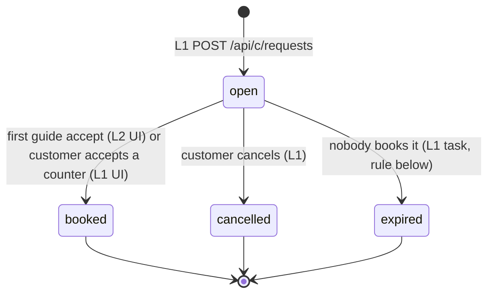
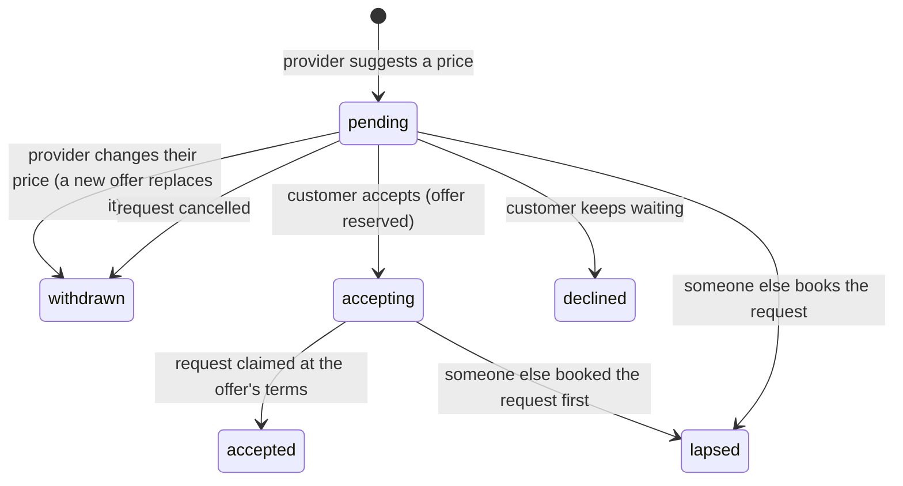
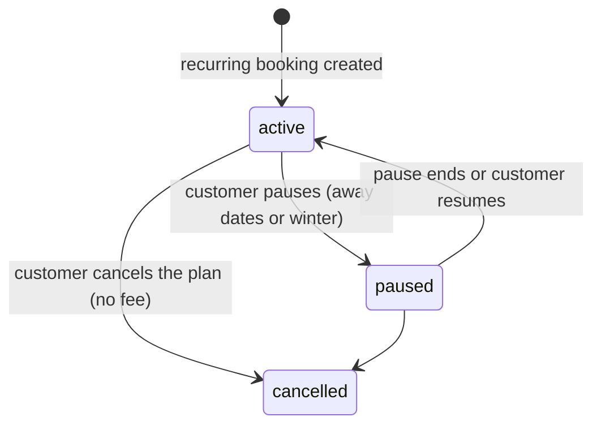
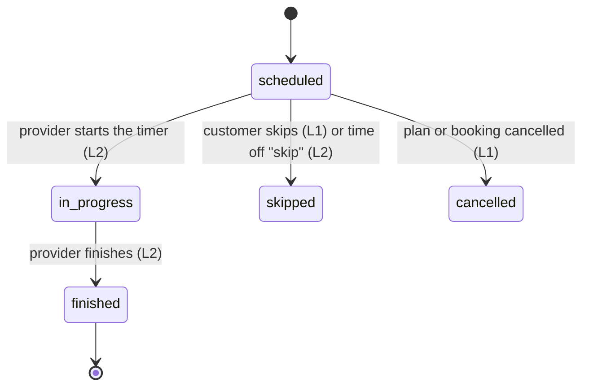
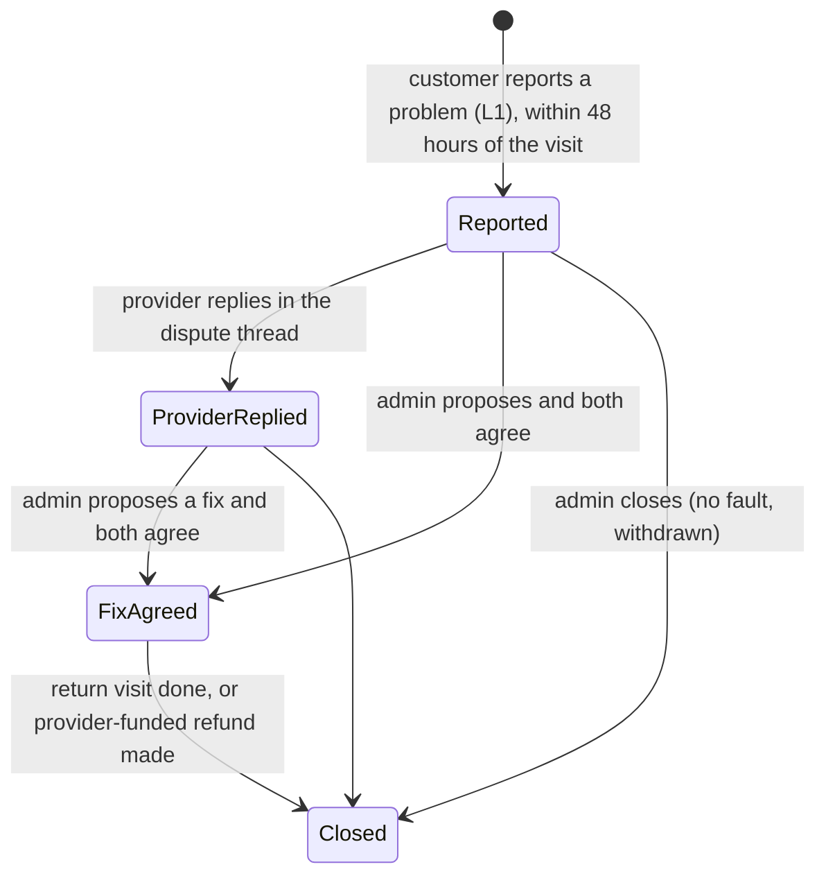
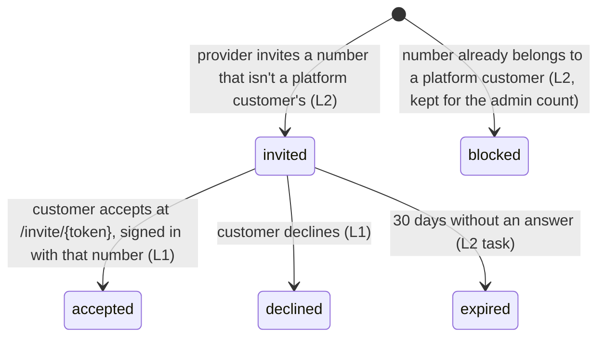
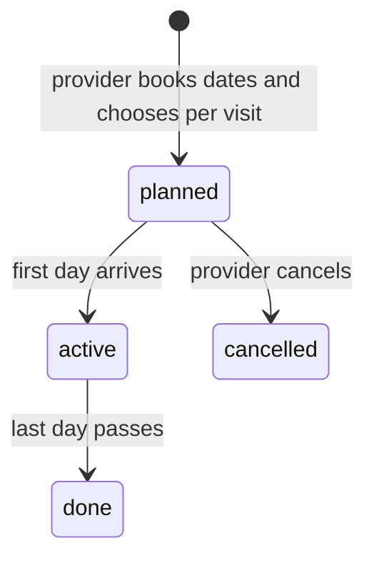

# State machines

Every status field, what moves it, who owns the move, and the outbox messages it sends
(template ids from `notifications.md`). Transitions not listed are not allowed. "Guarded"
means the update matches the expected current status in the same `findOneAndUpdate`, so a
concurrent change makes it a no-op (and the caller answers 409).

## Job request (`job_requests.status`)

| From | To | Trigger | Owner | Side effects |
|---|---|---|---|---|
| (new) | open | `POST /api/c/requests` with a quote, a resolved address, a saved card and terms accepted | L1 | `broadcast` = `eligibility.alert_targets`; one `job_alert` per target (text and/or WhatsApp per their settings, held for quiet hours with `not_before`, magic link to `/p/j/{ref}`); `request_sent` (or `request_no_providers` if nobody was eligible) |
| open | open | provider opens it | L2 | `JobRequests.record_view` adds a `viewed` event once per provider |
| open | open | provider counters | F | offer created; `countered` event; `counter_offer` to the customer |
| open | open | admin raises the guide | L3 | `guide_pence` up (whole pounds), `guide_raised` event, audit log |
| open | booked | provider accepts the guide | F (`marketplace.accept_at_guide`) | **atomic claim** on `status: "open"` and the guide read (409 `price_changed` if an admin raised it meanwhile), freezing the agreed prices; then resumable setup: booking, plan, visits, thread; pending counters lapse; `request_booked`, `booking_confirmed`, `job_taken` to lapsed counterers. Losers get 409 `already_taken` |
| open | booked | customer accepts a counter | F (`marketplace.accept_counter`) | same atomic claim (fails with 409 if a guide acceptance won) |
| open | cancelled | customer cancels | L1 | pending counters `withdrawn`; providers who countered are told (`job_taken`) |
| open | expired | open for 7 days with no booking | L1 (task) | suggested ruling for L1; the admin's "Waiting for a provider" list shows it until then |

`booked` is final: changes after booking happen on the booking, plan and visits.

## Counter-offer (`offers.status`)

At most one pending counter per provider per request (unique partial index). Offers are
immutable: a changed price withdraws the old offer and creates a new one (`supersedes`), so
accepting an offer id books exactly that offer's terms. Accepting reserves the offer
(`pending -> accepting`, guarded, so it can't be withdrawn), then claims the request at its
terms and marks it `accepted`; if the request was booked meanwhile the offer lapses and the
customer gets 409. An acceptance interrupted between the two steps is finished by a retry or
by the repair task after two minutes. A declined provider may still accept the guide price
while the request is open.

## Booking (`bookings.status`)

| From | To | Trigger | Owner |
|---|---|---|---|
| (new) | active | request booked (`source: platform`, `via: guide/counter`) | F (`services.bookings.create_booking`) |
| (new) | active | own-customer invite accepted (`source: own_customer`, `via: invite`) | L1 calls `create_booking` |
| (new) | active | "Book Dave again" request accepted by that provider (`via: direct`) | L1 creates the request; F books it |
| active | completed | a one-off's visit is finished and charged | L2 |
| active | cancelled | customer cancels a one-off before the visit, or cancels the plan | L1 |

`source` fixes the fee for every visit of the booking: platform = standard 15%,
own_customer = 5% with a 100p minimum.

## Recurring plan (`series.status`)

- Visits are materialised six weeks ahead (`schedule.ensure_horizon`, idempotent; hourly F task).
- Winter pause (outside categories): no visits 1 November to end of February; the plan stays
  `active` and simply has no visits then. Away pause: visits between the dates are not created
  (or are set `skipped` if they exist); `plan_changed` to the customer.
- Changing frequency (L1) cancels future `scheduled` visits that no longer fit and re-runs
  `ensure_horizon` from the next visit.
- `cover_when_away` decides whether the provider's time off may offer this plan's visits to cover.

## Visit (`visits.status`) and charge (`visits.charge.status`)

| From | To | Trigger | Owner | Side effects |
|---|---|---|---|---|
| scheduled | in_progress | `POST /api/p/visits/{id}/start` | L2 | `started_at`; helpers and cover providers may start visits they perform |
| in_progress | finished | `POST /api/p/visits/{id}/finish` | L2 | `minutes_actual`, `minutes_from_timer`, `flags`/`flags_none`, `overrun` (>110% of estimate), `over_25` (>125%); then the charge below |
| scheduled | skipped | customer skip, or time-off "skip" | L1 / L2 | `visit_skipped` to the customer |
| scheduled | (performer change) | "Send Tom" | L2 | `performer` = helper; `helper_coming` to the customer; payment still to the provider |
| scheduled | (cover) | time-off "cover" | L2 | see Time-off cover |

Charge, on finish (L2 calls the gateway; L3 owns the gateway and webhooks):

| From | To | Trigger | Side effects |
|---|---|---|---|
| none | succeeded | `charge_visit(visit, price, fee, account)` succeeds (fee from `money.split_for_visit(price, source, performer kind)`: own-customer rate only for the provider who brought the customer or their helper) | ledger `charge` entry (`services.ledger.record_charge`); `visit_done_customer`, `receipt`, `payment_on_its_way` |
| none | requires_action / failed | the bank wants confirmation, or the card is declined | `charge_failed_customer`, `charge_failed_provider`; no ledger entry until it succeeds (admin retry, L3) |
| pending | succeeded / failed | webhook (Stripe, L3) | as above; webhooks are the source of truth |
| succeeded | partially_refunded / refunded | admin refund (L3) | ledger `refund` entry (negative, `money.refund_split`); `refund_issued` |

A tip is charged separately (`purpose="tip"`, fee 0) and recorded as a ledger `tip` entry.

## Dispute (`disputes.stage`)

Stages are the prototype's: 0 Reported, 1 Provider replied, 2 Fix agreed, 3 Closed. The card
shows `status_text` (e.g. "Waiting for Alan's reply").

| Move | Owner | Side effects |
|---|---|---|
| open (stage 0) | L1 `POST /api/c/visits/{id}/problem` | dispute thread with customer, provider and admin; `problem_reported` to the customer, `dispute_opened` to the provider |
| message | L3 (admin), L2 (provider reply) | `dispute_message` |
| propose return visit / partial refund | L3 | `proposed`; `dispute_proposal` to both |
| close | L3 | `resolution`; refunds via the gateway (provider-funded, `money.refund_split`, ledger refund entry); `dispute_closed` |

We mediate; we don't guarantee. Copy never promises an outcome.

## Own-customer invite (`own_customer_invites.status`)

- The invite-only rule: a phone that belongs to a customer who joined through the platform
  (`customers.joined_via == "platform"`) is blocked, with the prototype's wording ("That number
  already belongs to a OneQuickJob customer, so they stay on the standard fee. Any regular work
  you already do for them is still yours.").
- Accepting creates (or reuses) the customer with `joined_via: own_customer`, then a booking
  with `source: own_customer` through `services.bookings.create_booking`; `invite_accepted` to
  the provider. The price is the provider's; the fee is not added to it.

## Time-off cover (`time_off.status` and each arrangement)

Each affected visit gets one arrangement:

| Action | What happens | State |
|---|---|---|
| cover (only if the plan allows cover) | A cover request for that one visit (`direct_provider_id` unset, same price, `cover_alert` to eligible providers through the normal offer flow). Whoever accepts becomes the visit's `performer` (kind `cover`) and is paid for it, at the standard 15% fee even on an own customer's visit; the customer stays the regular provider's (`cover_coming`). After the date, the series carries on with the original provider. | planned → arranged (someone took it) or failed (nobody did by the day before: the visit is skipped and the customer told) |
| helper | `performer` = the helper; `helper_coming` to the customer; the provider is paid | arranged |
| skip | visit `skipped`; `visit_skipped` to the customer | arranged |

`time_off_arranged` summarises it to the provider. New first-visit scheduling skips the
provider's time off (`schedule.first_slot`).
